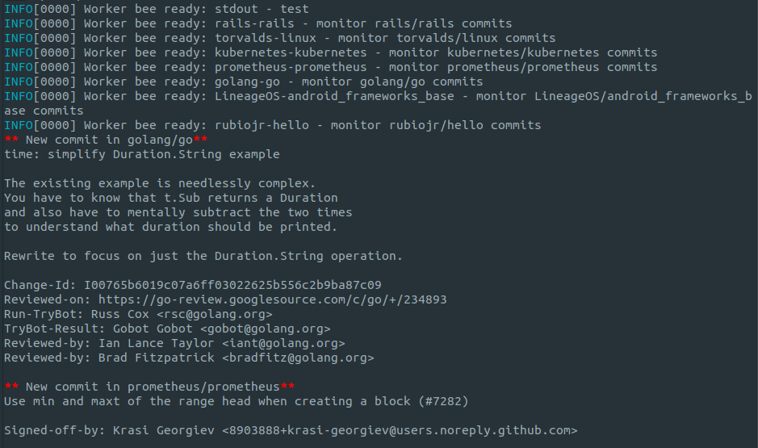

# Commit Monitor

[Beehive's](https://github.com/muesli/beehive) embedding example that demonstrates:

* How to embed Beehive and take advantage of the [hives](https://github.com/muesli/beehive/tree/master/bees) available.
* Use a custom out-of-tree hive for hives that aren't useful for the general audience or need to be private.

Uses the [experimental embedding API](https://github.com/muesli/beehive/pull/309).

## Building/installing

Run `go build`.

## Usage

[Create a personal access token](https://help.github.com/en/github/authenticating-to-github/creating-a-personal-access-token-for-the-command-line).

```
export GITHUB_TOKEN=<your-token-here>

./commit-monitor
````


## Example output



